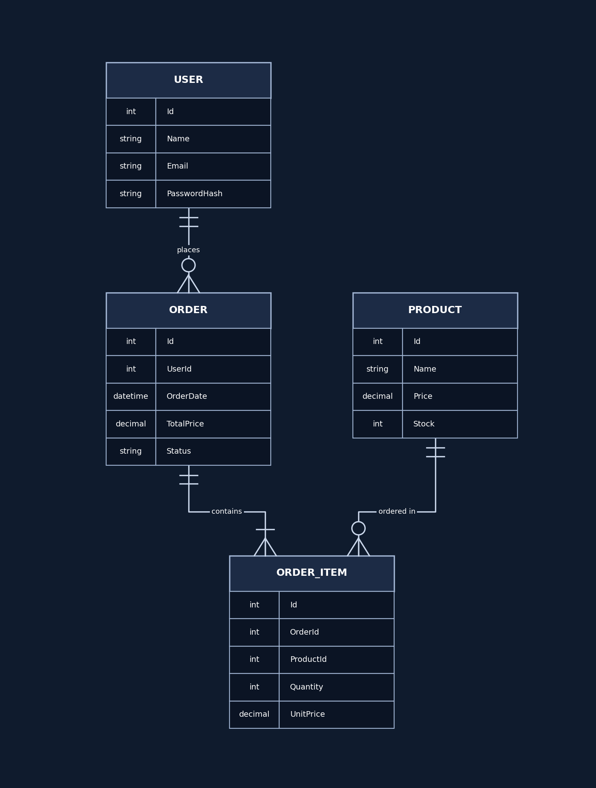

# Shoppix

Shoppix is a simple training project built before our graduation project. Its goal is for the team to practice working together and get to know each other. The app itself is a small e-commerce store with users, products, and orders.

## Tech Stack

| Area | Technology |
|------|------------|
| Frontend | Angular |
| Backend | .NET |
| Database | SQL Server |
| Mobile | Flutter |
| AI | TBD |

## Repository Structure

```
Shoppix/
├── frontend/   # Angular web app
├── backend/    # .NET API
├── mobile/     # Flutter app
├── ai/         # AI features
├── docs/       # Documentation (ERD, etc.)
└── .github/    # Pull request template
```

## Database

The database runs on SQL Server. The ERD is available at [`docs/erd.png`](docs/erd.png).



## Getting Started

```bash
git clone https://github.com/Hussein-Hashiem/Shoppix.git
cd Shoppix
```

### Backend (.NET)
```bash
cd backend
cp .env.example .env   # then fill in your SQL Server connection details
dotnet restore
dotnet run
```

### Frontend (Angular)
```bash
cd frontend
npm install
ng serve
```

### Mobile (Flutter)
```bash
cd mobile
flutter pub get
flutter run
```

### AI
TODO: add setup instructions once the stack is decided.

> These commands assume each project has already been created inside its folder (`dotnet new`, `ng new`, `flutter create`).

## Team

| Name | Role |
|------|------|
| Hussein | Backend |
| Youssef | Backend |
| Mohamed Sayed | Backend |
| Youstina | Frontend |
| Hagar | Frontend |
| Safaa | Frontend |
| Mohamed Abdullah | Mobile |
| Ali | Mobile |
| Mariam | AI |


## Branching

Work happens on task branches created from the develop branch of your area (`front-develop`, `back-develop`, `mobile-develop`, `ai-develop`). At the end of each sprint, each track lead merges their develop branch into `main`, with the team leader's approval. See [CONTRIBUTING.md](CONTRIBUTING.md) for details and read it before you start working.
